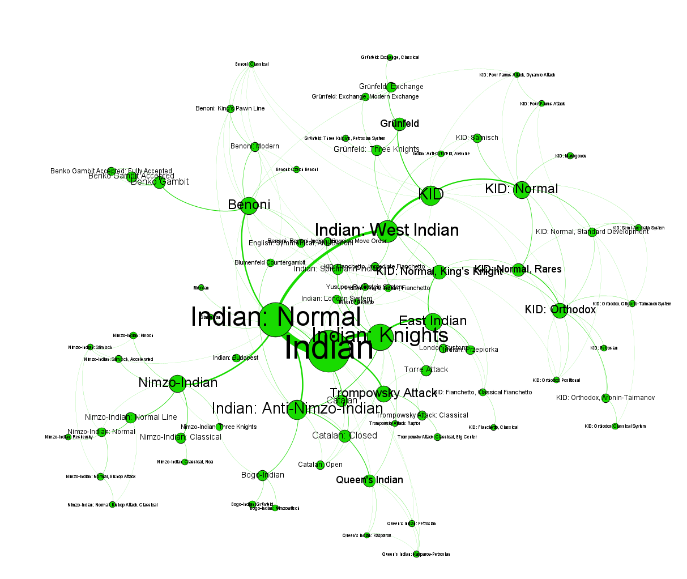

# Chess openings

## Idea

The opening of a chess game is the initial stage of the game. Both players develop their pieces and try to prepare their middle game. Many openings have standard names, such as _Sicilian Defence_ or _Russian Game_. Opening positions are defined by a given _position_ on the board. A game _transposes_ to a different opening, if it reaches a position which is normally reached by a different move order. In professional chess, opening transpositions are used to avoid certain lines, trick your opponent or force the opponent to play something unfamiliar.

For example, there are two move orders to reach the Queen's Gambit:

Move | Opening Name
--- | ---
1\. d4 | Queen's Pawn game
1\. ... d5 | Closed Game
2\. c4 | Queen's Gambit

Move | Opening Name
--- | ---
1\. c4 | English Opening
1\. ... d5 | Anglo-Scandinavian Defense
2\. d4 | Queen's Gambit

We transposed from the English Opening to a Queen's Gambit. The first order is considered solid and played very often. The second is considered unsound and therefore (almost) not played by pro players. If we analyze many chess games, we can build a graph were each node is a known opening position and edges are transpositions between openings (or opening variants).

## Methology

I analyzed 339,024 games between pro players from Lichess from April 2022. The opening data was the same as used in the opening explorer of Lichess. I parsed the games with `python-chess` and extracted the epd of the first 15 full moves. I then checked if this epd has a name. If the current position has a name that is different from the previous position, I added a transposition between the old and the new position.

The resulting graph is visualized with `Gephi`. The layout algorithm works so that connected nodes attract and not connected nodes repell each other. After a while we get a stable configuration where groups of strongly connected nodes emerge.

To get the colors I used the modularity algorithm. Modularity is a measure of how well connected nodes in a graph are. So we can find groups of nodes that are better connected to each other than to the rest of the graph. Each represents such a group. The size of a node is determinded by the number it has been reached. Same is true for the thickness of the edges.

## Results

### Overview

First we see the entire graph. We can clearly see a few very distinct groups and some groups that are very similar and not distinguishable.

Each color represents one or more opening families:
Color | Openings
--- | ---
Orange | Queen's Gambit
Green | Indian, Grünfeld, Benoni Defense(s)
Dark Green | Caro-Kann
Red | Zukertort, English, Réti Opening
Black | Sicilian Defense
Blue | King's Pawn: Caro-Kann, French, Modern, Scandinavian, Pirc, Alekhine Defense
Pink | King's Pawn: Scotch, Italian, Russian, Vienna Game, King's Gambit, Ruy Lopez
Grey | Noise, unregular openings, weird gambits

### Detail view

Now we look at each group individually. I filtered nodes with very low number of occurrences out so that we can see some of the variation names. Each subgraph again is run through the gephi force atlas algorithm.

## Conclusions

First, there is e clear distinction between Queen's Pawn Games on the left and King's Pawn Games on the right. It's said that transpositions are more frequently and important in Queen's Pawn Games than in King's Pawn Games. Using our graph we can confirm this. In particular the English and the Zukertort Opening often transpose into other lines of the Queens Gambit or some Indian defense. Using graph theory, we confirmed that strongly connected nodes in the graph are indeed variations of the same openings.

## Data

I used the opening data from [Lichess](https://github.com/lichess-org/chess-openings). Each named opening (variant) has a `name` and a `epd` [^1].

[^1]: A unique position of the pieces on the board.

The games are downloaded from the [Lichess Elite Database](https://database.nikonoel.fr/). I used the file from April 2022. The file is in `pgn` format. PGN files contain headers with metadata and the list of the moves in the game in Short Algebraic Notation. All players had a rating > 2400.
